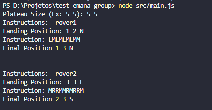

# Mars Rover Test

## Instalação

Use npm para instalação

```bash
npm install
```

Execute o sequinte comando para criar o banco de dados

```bash
npx sequelize db:create
```

Execute o sequinte comando para criar as tabelas no banco de dados

```bash
npx sequelize db:migrate
```

Execute o sequinte comando para executar a aplicação

```bash
node src/main.js
```

## Exemplo de Input


